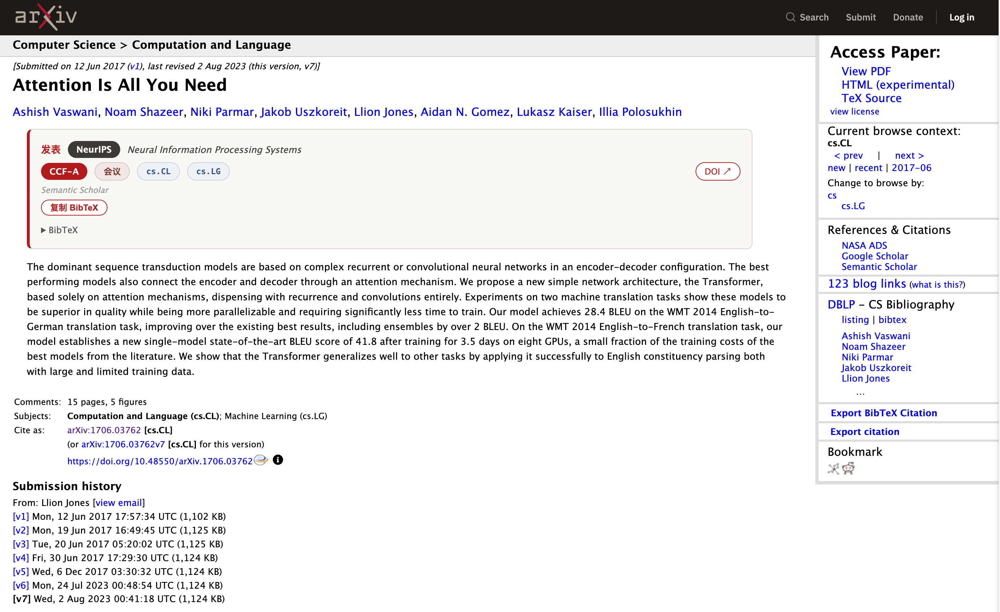

<div align="center">

# arXiv Venue & CCF

**在 arXiv abs 页直接看到论文正式发表在哪、CCF 评级、DOI 与 BibTeX**

Chrome MV3 扩展 · 零依赖 · 数据链路移植自 [arxiv-venue-resolver](https://github.com/zephyrq-z/arxiv-venue-resolver)



</div>

## 它做什么

打开任意 `arxiv.org/abs/…` 页面，摘要上方自动插入一张卡片：

| 字段 | 说明 |
|---|---|
| **[NeurIPS]** + 全称 | 正式发表 venue（缩写徽章 + 全称，hover 看完整名） |
| **CCF-A** | CCF 推荐目录评级（A 红底 / B 橙 / C 灰），681 个会议/期刊 |
| **会议 / 期刊** | venue 类型 |
| **cs.CL cs.LG** | 论文 arXiv 分类 |
| **DOI ↗** | 发表版直链（无 DOI 时给 S2/DBLP 链接） |
| **复制 BibTeX** | 一键复制；S2 现成 BibTeX 优先，预印本形态自动重拼为带正式 venue 的条目 |

未正式发表则明确显示"未见正式发表（预印本）"，并写入 90 天负缓存——之后重开该页 0 网络请求。

## 安装

### 从源码（开发者模式）

```bash
git clone https://github.com/zephyrq-z/arxiv-venue-ccf.git
```

1. 打开 `chrome://extensions`，右上角开启**开发者模式**
2. **加载已解压的扩展程序** → 选择仓库里的 `extension/` 目录

### 推荐：设置 Semantic Scholar API key

公共池限流严格（约每分钟 1 个请求）。[免费申请 key](https://www.semanticscholar.org/product/api#api-key-form)（1 req/s，全端点累计）后：

点扩展图标 → **S2 Key** 粘贴 → **保存 Key**（存 `chrome.storage.local`，随 `x-api-key` header 发送）。

> Chrome 扩展读不到 shell 环境变量（`~/.zshrc` 里的 `SemanticScholar_API_KEY`），粘贴一次即等价——持久化在浏览器本地。

## 解析链路（从最便宜到最权威，命中即停）

```
① 页面 journal_ref / DOI        0 请求，作者自报
①' comments "Accepted at X"     0 请求，作者自报
② Semantic Scholar by-id        权威，chrome.storage 持久缓存
③ S2 标题搜索                    S2 未合并 venue 时（含 arXiv 预印本去前缀重投）
④ DBLP API 兜底                  S2 查不到正式版时
⑤ CCF 目录匹配                   缩写 / 别名 / 全称，撞名按 arXiv 分类消歧
```

**限流处理**（对齐 S2 官方规格）：

- 节流：串行队列，有 key 1100ms/请求（1 rps 留 10% 余量），无 key 65s/请求
- 退避：429/403 优先尊重响应头 `Retry-After`，否则指数退避，S2 最多重试 5 次
- 缓存：解析结果持久化；负缓存（确认未发表）90 天过期；限流/断网结果**不写缓存**，刷新即重试

## 与 Super arXiv 等同类扩展的差异

| | Super arXiv | 本扩展 |
|---|---|---|
| CCF 评级 | 无 | 681 venue 目录 + 别名映射（PACMSE→FSE）+ 撞名消歧（FSE 既是加密 B 会又是软工 A 会） |
| 数据源可信度 | 不区分 | journal_ref / comments 标注 author-claimed；S2 / DBLP 权威 |
| 限流 | — | 官方规格节流 + Retry-After 退避 + 负缓存，每篇最多完整解析一次 |
| 兜底 | — | S2 by-id → S2 标题搜索 → DBLP |
| 未发表判定 | — | CoRR / arXiv 镜像 venue 视为未发表，继续找正式版；限流 ≠ 未发表（语义分离） |
| 数据源标注 | — | 卡片上直接标 `Semantic Scholar` / `arXiv comments (author-claimed)` 等 |

## 开发

```bash
python3 scripts/build_ccf_json.py  # 重新生成 data/ccf.json（源：arxiv-venue-resolver/ccf_v7.tsv）
npm run build                      # 同步 src/ + data/ 到 extension/（改 src 后必跑）
npm run test:offline               # 离线单测（无网络）：CCF 匹配/消歧/comments 提取/数据完整性
node test/one.mjs                  # 网络冒烟：真实 S2 解析
python3 scripts/e2e_check.py       # 端到端：headless Chrome + CDP 安装扩展 + abs 页断言
```

无依赖：Node ≥ 22（测试用）、Python 3（仅构建脚本）。扩展本体零构建零依赖。

## 文件结构

```
extension/            ← Chrome 加载这个目录
  manifest.json         MV3 清单（storage 权限 + S2/DBLP/arXiv host 权限）
  content.js            abs 页元数据提取（零请求）+ 卡片渲染
  background.js         SW：S2 节流退避、DBLP 兜底、缓存、API key
  popup.{html,js}       手动解析任意 arXiv ID + S2 key 设置
  style.css             卡片样式
  data/ccf.json         CCF 目录（681 条，生成物）
src/                  ← 逻辑源码（与 extension/ 同步，Node 可直接测试）
  resolver.js           解析链路
  ccf.js                CCF 匹配/消歧
scripts/              ← 构建 / E2E
test/                 ← 离线单测 + 网络冒烟
docs/screenshot.png   ← 预览图
```

## 已知限制

- S2 公共池限流严格：无 key 时首次解析可能要等 1–2 分钟退避（卡片会显示"解析失败（限流）——稍后刷新重试"，刷新即重试，不写缓存）。
- DBLP API 可能被 Anubis bot 防护拦截（取决于网络环境）；此时依赖 S2。
- 老式 arXiv ID（`math.AG/0701001` 带点子库）不解析，静默跳过。
- comments 提取的 venue 可能带尾部噪声（"CIKM 2026 as a full paper"），由 CCF 全称匹配与 S2/DBLP 兜底修正。

## License

MIT
